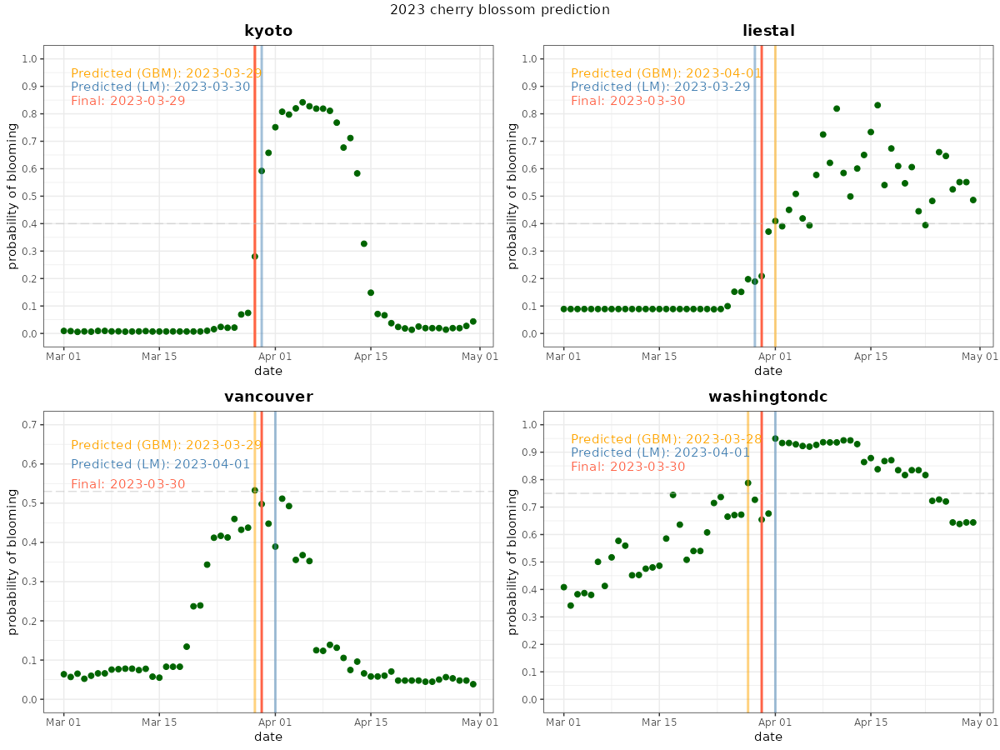
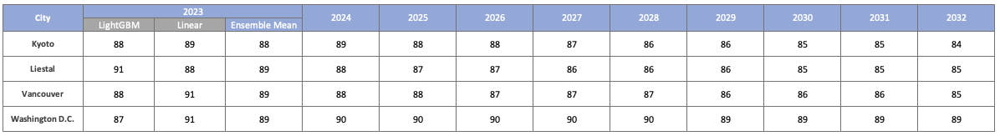

# 2023 Peak Cherry Blossom Prediction

## 1. Introduction

This project aims to predict the peak blooming dates of cherry blossoms for the year 2023 and beyond in four cities: Kyoto, Liestal, Vancouver, and Washington D.C. Given the variations in data availability, we employ a diverse range of methodologies, encompassing linearity-based models as well as comprehensive machine learning models. We propose that the utilization of the gradient-boosted algorithm in conjunction with phenology features enables accurate predictions of cherry blossom occurrences while simultaneously accounting for climate changes through the utilization of publicly available climate data. This report delineates our approach to data processing and model fitting, followed by the presentation of our findings and predictions. We aspire that our methods will facilitate cherry blossom enthusiasts in creating treasured memories.

## 2. Method

We applied various feature engineering techniques based on the availability of data. Specifically for Kyoto, we calculated the daily chill days (daily_Cd), anti-chill days (daily_Ca), and their accumulations (Cd_cumsum, Ca_cumsum), utilizing the method described by [Cesaraccio et al. (2004)](https://www.researchgate.net/publication/237564376_Improvement_of_chilling_and_forcing_model_to_predict_bud-burst). This method incorporates flexible growing degree day (GDD) accumulation start dates to respond promptly to climate changes. We selected nearby cities based on Euclidean distances from Kyoto, considering their geographical locations and the most recent 5-year records of bloom_doy. Subsequently, we constructed a classification model using the LightGBM algorithm (Ke et al., 2017) with a binary response variable is_bloom. The predictors encompassed geographical and phenology-based features. Our findings indicate that the LightGBM algorithm, trained on phenology-based data, effectively computed the probability of peak blooming for each day in March and April. We established our prediction based on the day when the probability of blooming exceeded the threshold probability.

For Liestal and Vancouver, due to inadequate historical temperature data, we utilized daily_GDD and accumulated GDD (AGDD) as features. In the case of Vancouver, we developed an AGDD-based LightGBM model using data from numerous cities in Japan, South Korea, and Switzerland, along with nearby NOAA weather stations. Additionally, we employed USA-NPN data to construct an AGDD-based LightGBM model for Washington D.C.

To address severe class imbalance, we employed under-sampling of the majority labels (is_bloom = 0). Our investigation revealed that the model trained on randomly under-sampled data outperformed other commonly used strategies such as the synthetic minority oversampling technique (SMOTE) and weighted sampling, which exhibited high false positive rates due to overfitting. Furthermore, we conducted 8-fold cross-validations to optimize the LightGBM parameters through a grid search involving 8 parameters, primarily aimed at reducing overfitting.

In addition to the comprehensive machine learning algorithms, we trained linear models that were not based on temperature. These models employed bloom_doy and year as the response variable and predictor, respectively. We utilized these models to obtain ensemble means of the model outputs for the year 2023, as well as to make non-temperature-based forecasts for subsequent years. For Kyoto and Washington D.C., we conducted piecewise regressions to identify potential changes in the bloom_doy trend over the past 200 and 100 years, respectively, utilizing their extensive observation data. Furthermore, we fitted a mixed-effects model for Liestal, using data from various locations across Switzerland, given the limited historical observation data. This model incorporated random slopes and intercepts, with altitude and year as fixed effects, while city was included as a random effect to account for the variation in bloom_doy. Lastly, we performed a linear regression using proxy cities selected from South Korea, Japan, and Switzerland. These proxy cities were chosen based on their similarities to Vancouver in terms of bloom_doy for the year 2022.

## 3. Results

Based on the feature importances derived from our LightGBM model, the phenology-based features Ca_cumsum and AGDD exhibited the most significant contributions to the model's accuracy, followed by the geographical information. This observation indicates that integrating phenology-based features with machine learning algorithms constitutes an effective approach for predicting peak cherry blossom occurrences.

Regarding the linear forecasts for Kyoto in 2023, we identified two significant trend changes in the bloom_doy over the past 200 years, specifically in 1928 and 2012. Increasing or decreasing the number of potential changepoints resulted in higher p-values for the variable year and lower $R^2$ values. The mixed-effects model applied to Liestal demonstrated that a substantial portion of the variance in the bloom_doy could be attributed to the variable city (>50%). Moreover, ANOVA conducted on the fixed effects revealed significant F-statistics, providing support for our model. In the case of Washington D.C., no significant changepoints were detected in the piecewise regression analysis spanning the last 100 years. Additionally, we did not identify any significant issues in the residual plots and Q-Q plots.

It is important to acknowledge the limitations of temperature-based methods. The performance of these models heavily relies on the accuracy and availability of temperature forecasts. Insufficient data in either aspect can lead to underperforming models. When historical bloom observations are unavailable, careful selection of proxy cities becomes crucial to ensure accurate predictions.

Nevertheless, our methods offer a flexible approach to estimating the probabilities of peak cherry blossoms on chosen days in March and April. By leveraging weather data encompassing a minimum of 4 months (AGDD) and a maximum of 7 months (chill-days), our approach enables rapid responsiveness to global climate changes, surpassing the limitations of traditional linear methods.

The predictions from our models are as follows:

## 4. Conclusion

This narrative elucidates the integration of gradient boosting methods and phenology-based feature engineering for cherry blossom prediction. Despite encountering various challenges, such as the availability of historical bloom observations and class imbalance, our test results substantiate that our method offers an accurate, reproducible, and interpretable approach to predicting peak cherry blossoms. Furthermore, our method demonstrates the capability to respond to climate changes. Additionally, we outline the steps involved in training non-temperature-based linear algorithms, which effectively capture changes in bloom day trends and leverage data from other cities while considering their inherent variability.
