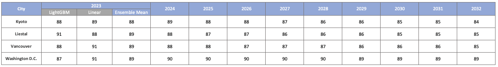

# 2023 Peak Cherry Blossom Prediction

 Author: Unknown, Affiliation: Unknown

## 1. Introduction

This project aims to predict the peak cherry blossom blooming dates for the year 2023 and beyond in four cities: Kyoto, Liestal, Vancouver, and Washington D.C. Owing to the different data availability, we implement a variety of different methods  - from linearity-based models to full-scale machine learning models. We outline that the gradient-boosted algorithm combined with phenology features can make accurate cherry blossom predictions while simultaneously considering climate changes by utilizing publicly available climate data. This report describes our methodology for data processing and model fitting, followed by the findings and final predictions. We hope our methods aid cherry blossom lovers in making most cherishing memories.

## 2. Methodology

We perform different feature engineering techniques depending on the available data. For Kyoto, we compute the daily chill days (`daily_Cd`), anti-chill days (`daily_Ca`), and the accumulations of the two (`Cd_cumsum`, `Ca_cumsum`) for Kyoto and nearby cities according to the original method illustrated by Cesaraccio et al., 2004, which is designed to respond rapidly to climate changes using flexible GDD accumulation start dates. The nearby cities were selected by the Euclidean distances to Kyoto with respect to their geographical location and their most recent 5-year `bloom_doy` records. We then built a classification model using the *LightGBM* algorithm (Ke et al., 2017) for a binary response `is_bloom`, using the predictors including the geography and the phenology-based features. We report that the LightGBM algorithm trained on the phenology-based data successfully computed the probability of peak blooming for each day of March and April, and we take the day of which the probability of blooming exceeds the threshold probability as our prediction. For Liestal and Vancouver,  `daily_GDD` and accumulated GDD (`AGDD`) owing to insufficient historical temperature data. For Vancouver, we built an AGDD-based LightGBM model using data from over a hundred cities across Japan, South Korea, and Switzerland with NOAA weather stations nearby. Furthermore, we utilize the USA-NPN data to build an AGDD-based LightGBM for Washington D.C.

We used under-sampling of the majority labels (`is_bloom` =0) to mitigate severe class imbalance. We found that the model trained using the randomly under-sampled data outperformed the other commonly used strategies, such as synthetic minority oversampling technique (SMOTE) and weighted sampling, the methods of which suffered from high false positive rates due to overfitting. Furthermore, we performed 8-fold cross-validations to tune the LightGBM parameters, with a grid search over 8 parameters, most of which aim to reduce overfitting.

In addition to the full-scale machine learning algorithms, we also trained non-temperature-based linear models. The response variable and predictors here were `bloom_doy`, and `year`. We not only used them to obtain the ensemble means of model outputs for the year 2023, but also made non-temperature-based forecasts for the later years. For Kyoto and Washington D.C., we performed piecewise regressions to detect possible changes in the `bloom_doy` trend over the most recent 200 and 100 years, respectively, owing to their rich observation data. Also, we fitted a mixed-effects model for Liestal using the data from all across Switzerland, due to the limited historical observation data. The model was fitted under the random slopes and intercepts assumptions, which included `altitude` and `year` as the fixed effects, and `city` as the random effect to account for the variance in `bloom_doy`. Lastly, performed a linear regression using proxy cities selected from all cities in South Korea, Japan, and Switzerland, depending on their similarities with Vancouver in `bloom_doy` for the year 2022.

## 3. Findings

From our LightGBM model’s feature importances, the phenology-based features `Ca_cumsum` and `AGDD` contributed the most to the accuracy of the models, followed by the geographical information. It tells us that integrating phenology-based features with machine learning algorithms is a good approach for peak cherry blossom predictions. 

The linear forecasts for Kyoto 2023 found two significant trend changes in `bloom_doy`  during the last 200 years - 1928 and 2012. Increasing or decreasing the number of possible changepoints resulted in higher p-values for `year`, and lower $R^2$. The mixed-effects model for Liestal found that a large portion of the variance in the `bloom_doy` can indeed be explained by `city` (>50%). ANOVA on the fixed effects found that the F-statistics for the effects were large, supporting our model. We did not find any changepoint in Washington D.C.’s piecewise regression over the last 100 years. We did not find any significant problems on the residual plots and Q-Q plots.

The limitations of the temperature-based methods are clear: models’ performances heavily depend on the accuracy and availability of the temperature forecasts. Insufficiency in either may result in an underperforming model. In the case where the historical bloom observations are unavailable, it is essential to choose the proxy cities carefully for accurate predictions. 

Nonetheless, our methods provide a flexible way to present peak cherry blossom probabilities for any chosen days in March and April by utilizing weather data corresponding to a minimum of 4 months (AGDD) and a maximum of 7 months (chill-days) that can promptly respond to global climate changes, unlike traditional linear methods.

## 4. Predictions

The predictions from our models are as follows:

If the mean is not an integer for the ensemble means, we put more weights on the LightGBM’s outputs.

## 5. Conclusion

This narrative described how cherry blossom prediction can be achieved by integrating gradient boosting methods and phenology-based feature engineering. Despite several challenges, including the historical bloom observation availability and class imbalance, the test results supported that our method provides an accurate, reproducible and interpretable procedure for predicting peak cherry blossoms, which can simultaneously respond to climate changes. We also provide steps for training non-temperature-based linear algorithms that can capture changes in the bloom day trends, and utilize the data from other cities while considering the variability between them. To conclude, we would like to thank the organizers and sponsors of this competition, and we would be happy to discuss more details, including model evaluation if queried. we hope our methods contribute to more successful cherry blossom picnics and event planning.
